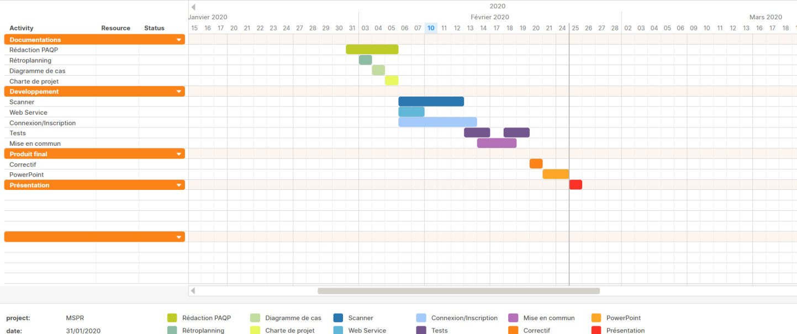
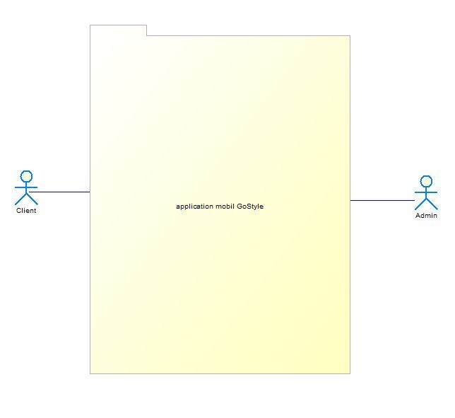
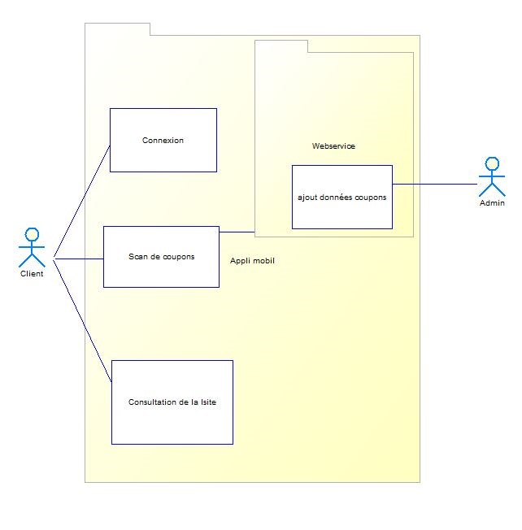
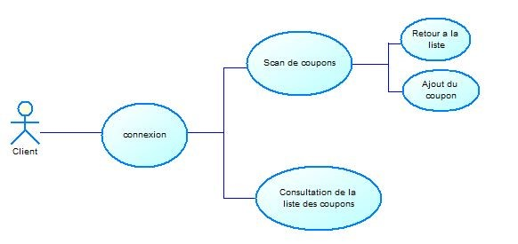

# MSPR 🐱‍🐉

## Contributeurs

| Contributeurs    | Rôles                 |
| ---------------- | --------------------- |
| Léo Dhédin       | Webservice            |
| Andrèa Cicirello | Test                  |
| Allan Arraud     | Liste Coupons         |
| Maxime Martinez  | Scanner & Support Git |
| Moussa BA        | Login                 |

## Description du projet

Une entreprise de vêtements et accessoire nous as contacté pour leur créer une application mobile permettant de scanner des QR Codes. Ces QR Codes contiennents des réductions choisis par l'entreprise. Le but est que l'utilisateur finale puisse gérer et scanner ces coupons de réduction dans l'application mobile dévelloper par nos soins.

## Technologies utilisées

* Java
* Android Studio  
* Github  
* Tomcat

## Rétroplanning

## Diagramme

## Maquettes de l'application

